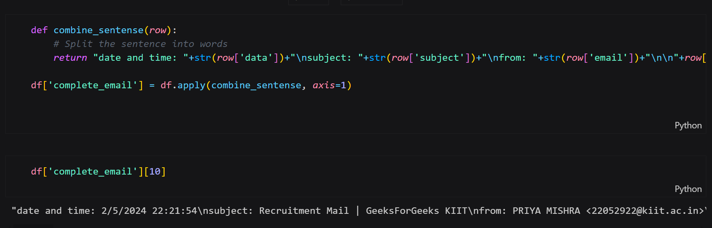
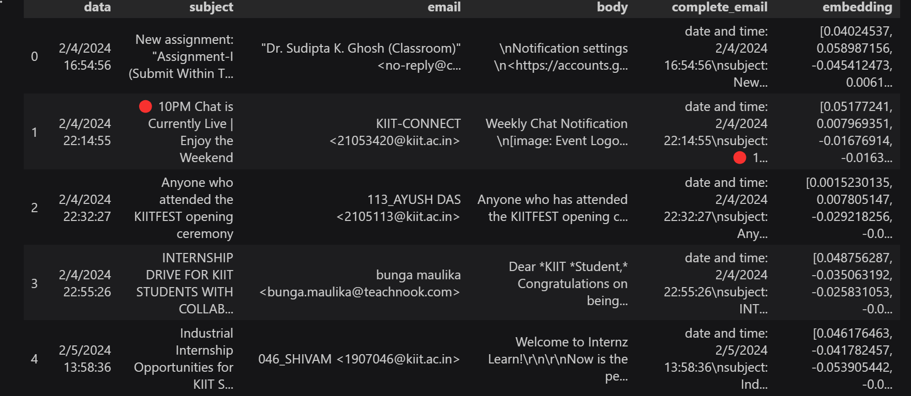
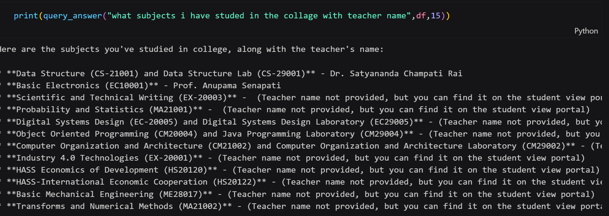

# Personalized_Gmail
This repository demonstrates a Retrieval Augmented Generation (RAG) system applied to email data. It showcases how to extract personal information from emails and use it to answer user queries. The system leverages Google's Text Embedding API for semantic search and Google's Generative AI for crafting natural language responses.

## System Architecture

The RAG system is implemented in Python and consists of the following key components:

1. **Data Loading and Preprocessing:**
   - Email data is loaded from a CSV file.
   - A `complete_email` column is created by combining the `date`, `time`, `subject`, `from`, and `body` fields for each email.

    

2. **Word Embedding Generation:**
   - Google's Text Embedding API (`models/text-embedding-ada-002`) is used to generate dense vector representations (embeddings) for each `complete_email`.
   - These embeddings capture the semantic meaning of the emails.

    

3. **Query Processing:**
   - User queries are first embedded using the same Text Embedding API.
   - Cosine similarity is calculated between the query embedding and all email embeddings.
   - The top-k most similar emails are retrieved, indicating the most relevant emails to the query.

4. **Response Generation:**
   - Google's Generative AI model is employed to formulate a response.
   - The model is provided with the original query and the retrieved relevant emails as context.
   - It generates a human-like response, incorporating information from the emails.

    

## Example Workflow

Let's illustrate the workflow with an example:

**User Query:** "Who is DMS teacher?"

1. **Embedding and Retrieval:**
   - The query is embedded.
   - Similarity search identifies emails discussing DMS-related topics.

2. **Response Generation:**
   - The Generative AI model receives the query and relevant emails.
   - It crafts a response like: "Based on your emails, the DMS teacher is [Teacher's Name]."

## Code Snippets

```python
import pandas as pd
from gensim.models import KeyedVectors
# Assuming 'genai' is properly set up for Google Generative AI
from genai import ... 

# **Google API Key Configuration** 
genai.configure(api_key='YOUR_API_KEY')

# **Create the model**
# See https://ai.google.dev/api/python/google/generativeai/GenerativeModel
generation_config = {
    "temperature": 1,
    "top_p": 0.95,
    "top_k": 64,
    "max_output_tokens": 10000,
    "response_mime_type": "text/plain",
}

model = genai.GenerativeModel(
    model_name="generative-model-1.5-flash", 
    generation_config=generation_config,
    # safety_settings - Adjust softy settings 
    # See https://ai.google.dev/dev/api-docs/safety-settings 
)
system_instruction= "You are a personal assistant who is helping vineet to respond to question based on the emails"


file_path = "/kaggle/input/email1-dataset/Untitled spreadsheet - mail (1).csv"
df = pd.read_csv(file_path)

def combine_sense(row):
    return "date and time: " + str(row['data']) + "||subject: " + str(row['subject']) + "||from: " + str(row['email']) + "||\n" + str(row['body'])

df['complete_email'] = df.apply(combine_sense, axis=1)

def embed_text(text):
    result = genai.embed_content(model="models/text-embedding-ada-002", content=text)
    return result['embedding']

df['embedding'] = df.apply(embed_text, axis=1)

df.to_pickle("email_embed.pkl")
df = pd.read_pickle("email_embed.pkl")


def query_answer(question, df, k=5):
    question_emd = genai.embed_content(model="models/text-embedding-ada-002", content=question)
    emb = question_emd['embedding']

    def questio(row):
        return emb

    df['question'] =  df.apply(questio, axis=1)

    def distance(row):
        return cosine_similarity(row['question'], row['embedding']) # you need to define or import cosine_similarity 

    df['distance'] = df.apply(distance, axis=1)
    sorted_df = df.sort_values('distance', ascending=False, inplace=False)

    def combine_email(k):
        text = ""
        for i in range(k):
            text += sorted_df['complete_email'].iloc[i] + "\n\n"
        return text

    text = combine_email(k)
    question_model = question + "\n\n" + "use this information from email as context to answer the question" + "comp"
    response = chat_session.send_message(question_model)
    return response.text

print(query_answer("what subjects i have studied in the collage with teacher name", df, 15))
